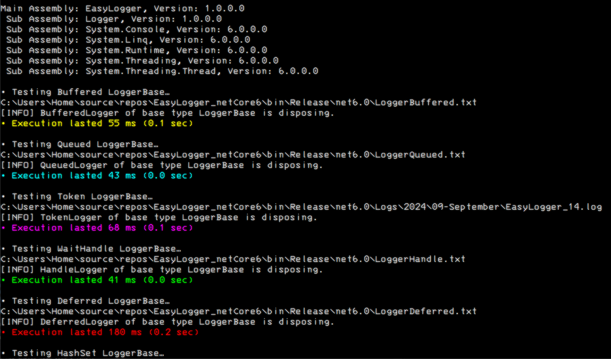
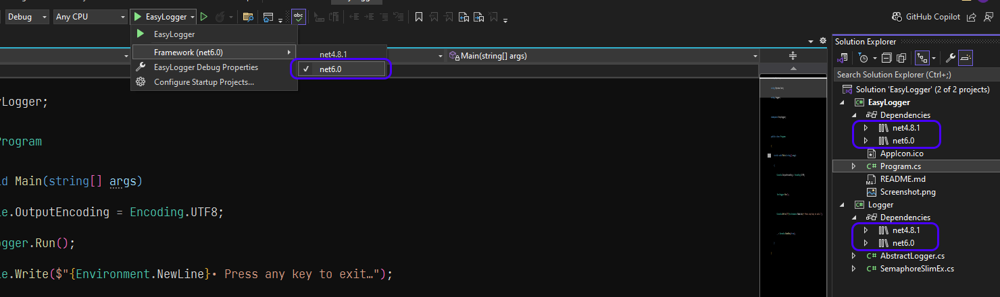

# EasyLogger

## v1.0.0.0 - August 2024
**Dependencies**

| Assembly | Version |
| ---- | ---- |
| NET Core | 6.0 |
| NET Framework | 4..8.1 |

- A logger library which offers deferred writing so as to not block the main execution thread.
- This solution includes a console application for testing the logger DLL.
- I've added a custom [SemaphoreSlim](https://learn.microsoft.com/en-us/dotnet/api/system.threading.semaphoreslim?view=netframework-4.8.1) for determining when it has been disposed. Ironically the BCL **SemaphoreSlim** does contain a **CheckDisposed()** method, but it's private.
	- From the [Dispose](https://learn.microsoft.com/en-us/dotnet/api/system.threading.semaphoreslim.dispose?view=netframework-4.8.1) notes: "*Always call Dispose before you release your last reference to the SemaphoreSlim. Otherwise, the resources it is using will not be freed until the garbage collector calls the SemaphoreSlim object's Finalize method.*"

- Selecting your preferred version in the IDE: 

